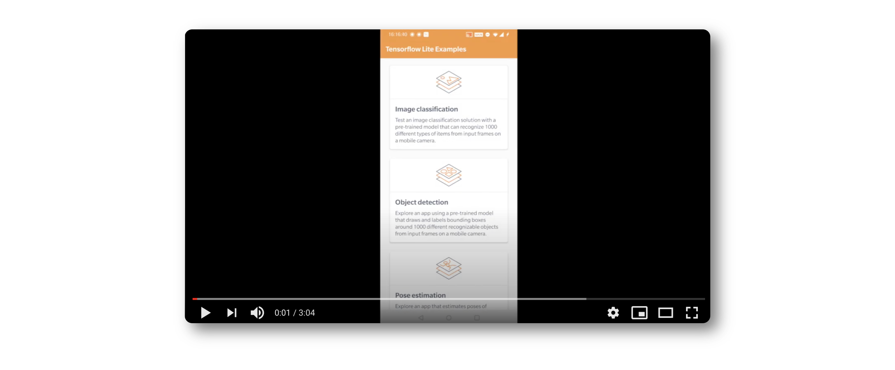
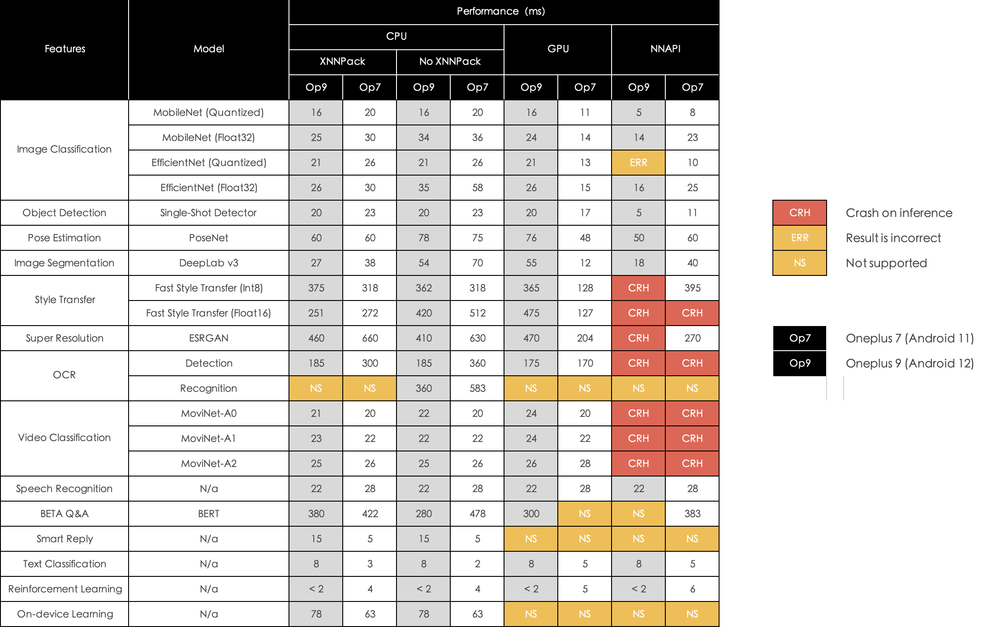

# TensorFlow Lite Examples - Android

This repository refactors and rewrites all the TensorFlow Lite examples for Android. They are officially illustrated on the TensorFlow official website. For more details, please refer to:

[https://www.tensorflow.org/lite/examples](https://www.tensorflow.org/lite/examples)

The target of this repository is to provide you with a much simpler way to use TensorFlow Lite on Android. It helps you easily understand how a captured Bitmap, a small buffer of raw audio data, or a piece of text are converted to run in inferences and how to represent results on the user interface.

## Templates
To make it easy to create your new example application, there are a few of boilerplate projects under the [templates](./templates) directory.

- [example-template](./templates/example-template), an empty project with the same basic UI as other examples in the repository. You can build your TensorFlow Lite example from scratch. 

- [example-template-with-litex](./templates/example-template), an empty project with the same basic UI as other examples in the repository. You can build your TensorFlow Lite example from scratch. Compare to the one above, it uses [a pre-buildt library](https://search.maven.org/artifact/cn.dailystudio/tensorflow-litex/1.4.5/aar) in the Maven Central instead of a module project "tensorflow-litex" in this repository.

- [example-image-template](./templates/example-image-template), more than providing the same design style as examples in the repository, it also includes basic facilities that support camera features. You can build your TensorFlow Lite example that requires Camera support.

- [example-image-template-with-litex](./templates/example-image-template), more than providing the same design style as examples in the repository, it also includes basic facilities that support camera features. You can build your TensorFlow Lite example that requires Camera support. Compare to the one above, it uses [a pre-buildt library](https://search.maven.org/artifact/cn.dailystudio/tensorflow-litex/1.4.5/aar) in the Maven Central instead of a module project "tensorflow-litex" in this repository.

There is also a [script](./scripts) that helps to create your project quickly from the boilerplate.

## Performance

Here is a performance test results on two Android phones and with two different Android versions. 

Compare to the official [performance tool](https://www.tensorflow.org/lite/performance/measurement) provided by TensorFlow Lite, the results are taken in a realistic running environment, which is also affected by other parts of the application and potential hardware resource occupation.

In this test, Oneplus 7 (Snapdragon 855) is a flagship device in 2019, where as Oneplus 9 (Snapdragon 888) is a flagship device in 2021. Oneplus 7 is running with Android 11, while Oneplus 9 is running with Android 12. Both of them have 12 RAM on device.

## License

    Copyright 2022 Daily Studio.

    Licensed under the Apache License, Version 2.0 (the "License");
    you may not use this file except in compliance with the License.
    You may obtain a copy of the License at
    
       http://www.apache.org/licenses/LICENSE-2.0
    
    Unless required by applicable law or agreed to in writing, software
    distributed under the License is distributed on an "AS IS" BASIS,
    WITHOUT WARRANTIES OR CONDITIONS OF ANY KIND, either express or implied.
    See the License for the specific language governing permissions and
    limitations under the License.
